# Walking Tour: System Architecture & Roadmap

> **Comprehensive guide to building a procedural narrative engine for real-world exploration**

---

## Table of Contents

- [Executive Summary](#executive-summary)
- [System Architecture Overview](#system-architecture-overview)
- [The Roadmap: Phase by Phase](#the-roadmap-phase-by-phase)
  - [Phase 1: Static Tour Generator ✅](#phase-1-static-tour-generator-)
  - [Phase 2: Route Intelligence 🔜](#phase-2-route-intelligence-)
  - [Phase 3: RAG & Embeddings 📋](#phase-3-rag--embeddings-)
  - [Phase 4: Location-Aware Prototype 📋](#phase-4-location-aware-prototype-)
  - [Phase 5: Web Interface 📋](#phase-5-web-interface-)
- [Technical Deep Dives](#technical-deep-dives)
- [Key Design Principles](#key-design-principles)
- [Evaluation Framework](#evaluation-framework)
- [Cost Model & Scaling Strategy](#cost-model--scaling-strategy)
- [Future Considerations](#future-considerations)
- [Appendices](#appendices)

---

## Executive Summary

### What We've Built

**Phase 1 (Complete)**: A validated content generation pipeline that transforms curated facts into engaging, persona-matched audio narratives with built-in fact-checking.

**Key Achievements**:
- ✅ Four distinct persona voices (Architect, Ghost Hunter, Local, Time Traveler)
- ✅ GPT-4o narrative generation with structured "Beat Sheet" format
- ✅ GPT-4o-mini fact-checking rail (strict about facts, lenient about style)
- ✅ OpenAI TTS audio synthesis with persona-matched voices
- ✅ 50 manually curated Richmond POIs as test dataset

### What's Next

**5-Phase Roadmap** to transform static tour generator into a fully dynamic, location-aware application:

1. **Phase 2**: Route Intelligence - Automated POI selection and route planning
2. **Phase 3**: RAG & Embeddings - Semantic search for better personalization
3. **Phase 4**: Location-Aware Prototype - GPS-triggered playback
4. **Phase 5**: Web Interface - Mobile PWA for public use

### Key Metrics

- **Cost per tour**: ~$0.05 (Phase 1) → Target $0.01 (Phase 4 with caching)
- **Personas**: 4 distinct voices with unique narrative styles
- **Fact-checking threshold**: 90% confidence minimum
- **Target latency**: <60s to generate 30-minute tour (Phase 5)

---

## System Architecture Overview

Walking Tour uses a **4-layer architecture** designed around Retrieval-Augmented Generation (RAG):


### Layer 1: Knowledge Layer

**Purpose**: Store all location-based facts, visual cues, and metadata

**Components**:
- **POI Database**: Core repository of points of interest
- **Data Pipeline**: Automated ingestion and processing
- **Sources**: OpenStreetMap, Wikidata, Wikipedia, Google Places

**Key Features**:
- **Geo-hashing**: Efficient spatial indexing for location queries
- **Deduplication**: Merge POIs within 15m with fuzzy name matching (>0.8 similarity)
- **Visual Extraction**: Use Vision LLM on Street View to extract navigation cues
- **Vibe Tagging**: Categorize content (Gory, Romantic, Architectural, etc.)

### Layer 2: Context Layer

**Purpose**: Capture user preferences and environmental context

**Static Context**:
- User interests/persona selection
- Available time for tour
- Accessibility requirements

**Dynamic Context**:
- Real-time GPS location
- Time of day (affects recommendations: daytime vs. evening tours)
- Weather (influences route selection: covered areas when raining)

### Layer 3: Orchestrator (The Brain)

**Purpose**: RAG pipeline that retrieves, generates, and validates content

**Query Process**:
1. **Retrieve**: Score and rank POIs using formula: `S = α(U·P) + β(Pop) + γ(Nov) - δ(Dist)`
2. **Generate**: GPT-4o weaves facts into narrative using "Beat Sheet" structure
3. **Verify**: GPT-4o-mini fact-checks against source material

**Critical Safety Feature**:
> **Navigation instructions come from deterministic routing engine**, not the LLM. This prevents hallucinations like "turn right at the bridge" when no bridge exists.

### Layer 4: Presentation Layer

**Purpose**: Deliver polished audio experience

**Components**:
- **Text-to-Speech**: High-quality voice synthesis (OpenAI TTS or ElevenLabs)
- **Persona Matching**: Voice selection based on user-chosen persona
- **Audio Cues**: Distinct sounds separate directions from stories
- **Pacing**: SSML tags control speed, pauses, emphasis

---

## The Roadmap: Phase by Phase

### Phase 1: Static Tour Generator ✅

<span class="phase-complete">COMPLETE</span>

#### Goals

Prove the content generation pipeline works: facts → narrative → verification → audio

**Success Criteria**:
- ✅ Each persona sounds distinct and consistent
- ✅ Facts are accurate (no hallucinations detected)
- ✅ Audio pacing is natural and easy to follow
- ✅ Navigation instructions are clear and safe

#### What Was Built


**Components**:

1. **POI Dataset**: 50 manually curated Richmond locations
   - Castle, market square, historical buildings
   - Each POI has: name, coordinates, historical facts, visual cues
   - Tagged with vibe categories (history, architecture, dark_history, etc.)

2. **Persona Prompts**: 4 distinct narrative styles
   - **The Architect**: Technical, appreciative, focused on design
   - **The Ghost Hunter**: Suspenseful, whispered, mysterious
   - **The Local**: Casual, friendly, insider knowledge
   - **The Time Traveler**: Immersive, sensory, transportive

3. **Beat Sheet Structure**: 5-part format for each POI
   - Hook → Visual Anchor → Story → Synthesis → Directions

4. **Fact-Checking Rail**: Double-loop verification
   - Verifier compares generated content against source facts
   - Confidence threshold: 0.9 (90%)
   - Outputs: `{pass: bool, hallucinations: [], confidence: float}`

5. **Audio Synthesis**: OpenAI TTS with voice matching
   - Architect: Clear, measured voice
   - Ghost Hunter: Whispered, intimate voice
   - Local: Warm, conversational voice
   - Time Traveler: Rich, narrative voice

#### Architecture Diagram: Phase 1


#### Evaluation Techniques

**1. Persona Distinctiveness Test**
- Generate same POI for all 4 personas
- Blind listening test: Can you identify which persona?
- **Result**: [To be filled after testing]

**2. Fact Accuracy Audit**
- Spot-check 20 generated segments against Wikipedia
- Count hallucinations (0 tolerance)
- **Result**: [To be filled after testing]

**3. Audio Pacing Assessment**
- Listen while walking at normal pace (3 mph)
- Note any rushed or dragging sections
- **Result**: [To be filled after testing]

**4. Navigation Clarity Test**
- Follow audio directions without looking at map
- Success = reach destination without backtracking
- **Result**: [To be filled after testing]

#### Cost Breakdown (Phase 1)

| Component | Model/Service | Cost per Tour | Notes |
|-----------|---------------|---------------|-------|
| Generation | GPT-4o | $0.015 | ~3,000 tokens output |
| Verification | GPT-4o-mini | $0.002 | ~1,000 tokens output |
| Audio Synthesis | OpenAI TTS | $0.030 | ~2,000 words @ $15/1M chars |
| **Total** | | **~$0.047** | 30-minute tour, 6 POIs |

**Optimization Opportunities** (for future phases):
- Cache common TTS segments ("Turn left in 50 meters") → -$0.005
- Batch generation for popular routes → -$0.003
- Use GPT-4o-mini for simple descriptions → -$0.008
- **Target**: $0.03/tour by Phase 3

#### Key Learnings

> **To be documented after field testing**

Expected insights:
- Which persona is most engaging?
- Are visual cues sufficient for navigation?
- How long should pause between POIs be?
- Does fact-checking catch all errors?

---

### Phase 2: Route Intelligence 🔜

<span class="phase-next">NEXT</span>

#### Goals

Automatically generate optimal walking routes based on user context

**Success Criteria**:
- ✅ "Horror" tour selects castle over tea shop
- ✅ Routes are walkable (no backtracking, reasonable distances)
- ✅ Time estimates are accurate (±5 minutes)
- ✅ POI selection changes meaningfully per persona

#### What to Build


**Components**:

1. **POI Scoring Formula**

```
S_poi = α(U · P) + β(Pop) + γ(Nov) - δ(Dist)

Where:
  U = User Interest Vector [history, architecture, food, horror...]
  P = POI Embedding Vector (same dimensions)
  Pop = Popularity Score (0-1, based on Google ratings/reviews)
  Nov = Novelty Score (0-1, inverse of how often POI is visited)
  Dist = Distance Penalty (meters from current location)

  α = 0.5 (interest match weight)
  β = 0.2 (popularity weight)
  γ = 0.1 (novelty weight)
  δ = 0.001 (distance penalty per meter)
```

**Example Calculation**:

```
User = [history: 0.9, architecture: 0.3, horror: 0.8, food: 0.1]
POI (Richmond Castle) = [history: 1.0, architecture: 0.7, horror: 0.6, food: 0]

Dot product (U · P) = (0.9×1.0) + (0.3×0.7) + (0.8×0.6) + (0.1×0) = 1.59

S_castle = 0.5(1.59) + 0.2(0.9) + 0.1(0.3) - 0.001(0)
         = 0.795 + 0.18 + 0.03 - 0
         = 1.005

Interpretation: High score → prioritize this POI
```

2. **Route Graph Structure**

```mermaid
graph LR
    Start[Starting Location] -->|300m| POI1[Richmond Castle]
    POI1 -->|150m| POI2[Market Square]
    POI2 -->|200m| POI3[Grey Friars Tower]
    POI3 -->|400m| POI4[Holy Trinity Church]
    POI4 -->|250m| POI5[Millgate]
    POI5 -->|180m| End[Ending Point]

    style Start fill:#E1BEE7
    style POI1 fill:#C8E6C9
    style POI2 fill:#C8E6C9
    style POI3 fill:#C8E6C9
    style POI4 fill:#C8E6C9
    style POI5 fill:#C8E6C9
    style End fill:#BBDEFB
```



**Route Constraints**:
- Prioritize pedestrian paths (exclude highways)
- Consider incline (prefer flat routes for accessibility)
- Scenic value weighting (parks > parking lots)
- Safety score (lighting for evening tours)

3. **Routing Engine Integration**

**Option A: Mapbox Directions API** (Easier MVP)
- Pedestrian-optimized routing
- ~$0.005 per route request
- Simple REST API

**Option B: Valhalla** (Better long-term)
- Self-hosted (no per-request costs)
- More control over weighting
- Steeper learning curve

**Decision**: Start with Mapbox, migrate to Valhalla in Phase 4

4. **Route Optimization Algorithm**

```python
# Pseudocode for route generation
def generate_route(user_context, available_time):
    # Step 1: Score all POIs
    all_pois = get_pois_in_radius(user_location, radius=2000m)
    scored_pois = [score_poi(poi, user_context) for poi in all_pois]

    # Step 2: Greedily select POIs
    route = []
    current_location = user_context.start_location
    remaining_time = available_time

    while remaining_time > 10_minutes:
        # Find highest scoring POI within time budget
        candidate_pois = [p for p in scored_pois
                          if estimated_time(current_location, p) < remaining_time]

        if not candidate_pois:
            break

        next_poi = max(candidate_pois, key=lambda p: p.score)
        route.append(next_poi)

        # Update state
        travel_time = estimated_time(current_location, next_poi)
        remaining_time -= (travel_time + 5_minutes)  # 5 min per POI
        current_location = next_poi.location
        scored_pois.remove(next_poi)

    # Step 3: Get turn-by-turn directions
    directions = mapbox.get_directions([p.location for p in route])

    return route, directions
```

#### Architecture Diagram: Phase 2 Additions

```mermaid
graph TB
    subgraph "NEW: Route Planning Layer"
        direction TB
        Scorer[POI Scorer<br/>Interest × Popularity × Distance]
        Router[Routing Engine<br/>Mapbox API]
        Optimizer[Route Optimizer<br/>Time-constrained greedy]
    end

    subgraph "Existing: Generation Layer"
        Generator[GPT-4o Generator]
        Verifier[GPT-4o-mini Verifier]
    end

    subgraph "Existing: Data Layer"
        POI[(POI Database)]
    end

    POI --> Scorer
    Scorer --> Router
    Router --> Optimizer
    Optimizer --> Generator
    Generator --> Verifier

    style Scorer fill:#FFCCBC
    style Router fill:#FFCCBC
    style Optimizer fill:#FFCCBC
```



#### Evaluation Techniques

**1. Persona Differentiation Test**
- Generate routes for all 4 personas from same starting point
- **Expected**: Different POIs selected (Ghost Hunter → castle, Local → pubs)
- **Metric**: POI overlap <30% between personas

**2. Time Accuracy Test**
- Generate 10 routes with 30/45/60 minute constraints
- Walk routes with GPS tracker
- **Metric**: Actual time within ±10% of estimate

**3. Walkability Assessment**
- Check for backtracking (should be minimal)
- Verify pedestrian-friendly paths (no highway crossings)
- **Metric**: User reaches all POIs without navigation confusion

**4. Relevance Scoring**
- Manual review: Do selected POIs match user interests?
- **Metric**: 4/5 POIs should clearly relate to chosen persona

#### Cost Breakdown (Phase 2)

| Component | Service | Cost per Tour | Notes |
|-----------|---------|---------------|-------|
| POI Scoring | Local compute | $0.000 | Simple vector operations |
| Routing | Mapbox Directions | $0.005 | 1 route request |
| Generation | GPT-4o | $0.015 | Same as Phase 1 |
| Verification | GPT-4o-mini | $0.002 | Same as Phase 1 |
| Audio | OpenAI TTS | $0.030 | Same as Phase 1 |
| **Total** | | **~$0.052** | +$0.005 vs Phase 1 |

#### Implementation Steps

1. **Expand POI dataset** (50 → 150 Richmond locations)
2. **Implement POI scoring** (Python function with tunable weights)
3. **Integrate Mapbox API** (pedestrian directions)
4. **Build route optimizer** (greedy algorithm with time constraints)
5. **Test persona differentiation** (same start, different routes per persona)
6. **Field test** (walk generated routes, measure time accuracy)

---

### Phase 3: RAG & Embeddings 📋

<span class="phase-planned">PLANNED</span>

#### Goals

Replace keyword matching with semantic search for better personalization

**Success Criteria**:
- ✅ Query "spooky stories" returns different POIs than "medieval architecture"
- ✅ Similarity search outperforms keyword matching (A/B test)
- ✅ User interest matching improves (measured by implicit feedback)

#### What to Build


**Components**:

1. **Embedding Model**
   - **Choice**: OpenAI `text-embedding-3-small`
   - **Dimensions**: 1536
   - **Cost**: $0.00002 per 1K tokens (~$0.001 per tour)
   - **Alternative**: Open-source `sentence-transformers` (free, self-hosted)

2. **Vector Database Options**

| Option | Pros | Cons | Cost |
|--------|------|------|------|
| **Qdrant** | Fast, hybrid search, cloud-hosted | Learning curve | $25/month starter |
| **pgvector** | Postgres extension, familiar | Slower at scale | Self-hosted |
| **Pinecone** | Managed, easy setup | Expensive at scale | $70/month |

**Decision**: Start with Qdrant (good balance of features + cost)

3. **Hybrid Search Strategy**

```python
# Pseudocode for hybrid search
def search_pois(user_query, user_location, top_k=15):
    # Step 1: Embed user query
    query_vector = embed(user_query)

    # Step 2: Vector similarity search
    vector_results = qdrant.search(
        collection="pois",
        query_vector=query_vector,
        limit=30,  # Over-retrieve
        filter={
            "location": within_radius(user_location, 2000m)
        }
    )

    # Step 3: Keyword search (fallback for proper nouns)
    keyword_results = qdrant.search(
        collection="pois",
        query_text=user_query,
        limit=10
    )

    # Step 4: Merge and re-rank
    combined = merge_results(vector_results, keyword_results)
    ranked = rank_by_relevance(combined, user_query)

    return ranked[:top_k]
```

**Why Hybrid?**
- Vector search: Great for concepts ("romantic", "spooky")
- Keyword search: Better for names ("Richmond Castle", "William the Conqueror")

4. **POI Embedding Schema**

```json
{
  "id": "poi_richmond_castle_001",
  "name": "Richmond Castle",
  "location": {"lat": 54.4045, "lon": -1.7405},
  "description": "Norman castle built in 1071...",
  "tags": ["history", "medieval", "architecture", "dark_history"],
  "embedding": [0.234, -0.567, 0.123, ...],  // 1536 dimensions
  "metadata": {
    "year_built": 1071,
    "architect": "Alan Rufus",
    "popularity_score": 0.89
  }
}
```

#### Architecture Diagram: Phase 3 Additions


#### Evaluation Techniques

**1. Semantic Search Quality Test**
- Query pairs with similar meaning, different words:
  - "dark history" vs "tragic events"
  - "beautiful buildings" vs "architectural gems"
- **Metric**: Overlap in results should be >70%

**2. A/B Test: Keywords vs Vectors**
- Generate 20 tours using keyword matching (Phase 2)
- Generate same 20 tours using vector search (Phase 3)
- Blind preference test: Which tour feels more relevant?
- **Metric**: Vector search preferred >60% of time

**3. Retrieval Precision**
- Manual labeling: Which POIs are truly relevant to query?
- **Metric**: Precision@10 (how many of top 10 results are relevant?)
- **Target**: >80% precision

**4. Diversity Test**
- Do "horror" and "architecture" queries return different POIs?
- **Metric**: Overlap <40% (ensures personalization works)

#### Cost Breakdown (Phase 3)

| Component | Service | Cost per Tour | Notes |
|-----------|---------|---------------|-------|
| Embedding | OpenAI text-embedding-3-small | $0.001 | Embed user query + preferences |
| Vector Search | Qdrant | $0.000 | Included in $25/month plan |
| Routing | Mapbox | $0.005 | Same as Phase 2 |
| Generation | GPT-4o | $0.015 | Same as Phase 2 |
| Verification | GPT-4o-mini | $0.002 | Same as Phase 2 |
| Audio | OpenAI TTS | $0.030 | Same as Phase 2 |
| **Total** | | **~$0.053** | +$0.001 vs Phase 2 |

**Note**: Cost increase is minimal (~2%) but relevance improvement expected to be significant.

#### Implementation Steps

1. **Set up Qdrant instance** (cloud-hosted)
2. **Generate embeddings for 150 POIs** (batch process)
3. **Implement hybrid search** (vector + keyword)
4. **A/B test vs keyword matching** (measure relevance improvement)
5. **Tune search parameters** (vector weight vs keyword weight)
6. **Monitor retrieval quality** (precision, diversity)

---

### Phase 4: Location-Aware Prototype 📋

<span class="phase-planned">PLANNED</span>

#### Goals

GPS-triggered audio playback for real walking tours

**Success Criteria**:
- ✅ Audio plays automatically when within 20m of POI
- ✅ System handles GPS drift gracefully (±20m noise)
- ✅ Works on mobile browser (no app install required)
- ✅ Tours can be downloaded for offline use

#### What to Build


**Components**:

1. **GPS Tracking**
   - **API**: Browser Geolocation API (no native app required)
   - **Update Frequency**: Every 5 seconds
   - **Accuracy**: ±10-20m typical (urban environments)

2. **Proximity Trigger Logic**

```python
# Pseudocode for proximity detection
def monitor_location(tour, current_poi_index):
    while current_poi_index < len(tour.pois):
        current_position = get_gps_location()
        next_poi = tour.pois[current_poi_index]

        distance = calculate_distance(current_position, next_poi.location)

        if distance < 20_meters:
            play_audio(next_poi.audio)
            current_poi_index += 1
        elif distance > 100_meters:
            # User wandered off path
            show_warning("You seem off path. Head back to {next_poi.name}")

        wait(5_seconds)
```

**Edge Cases**:
- **GPS drift**: If location jumps >50m, wait for stable signal
- **Skipped POI**: If user passes POI without triggering, play anyway after 2 minutes
- **Backtracking**: Allow replaying previous POIs if user returns

3. **Offline Support**

**Strategy**: Download full tour at start
- Pre-generate all audio files (~15 MB for 30-min tour)
- Cache using Service Workers (PWA)
- Metadata stored in localStorage

**Benefits**:
- No streaming latency
- Works in areas with poor cell signal
- Predictable costs (no per-play fees)

4. **Audio State Machine**


5. **Mobile Web Interface (PWA)**

**Features**:
- **No app install required** (runs in browser)
- **Add to Home Screen** (behaves like native app)
- **Background audio** (plays while screen is locked)
- **Offline mode** (Service Workers cache tour data)

**Tech Stack**:
- **Framework**: React or Svelte (lightweight)
- **Maps**: Mapbox GL JS (show current location + route)
- **Audio**: Web Audio API (precise control over playback)

#### Architecture Diagram: Phase 4 Additions


#### Evaluation Techniques

**1. GPS Accuracy Test**
- Walk 10 routes with GPS tracking enabled
- **Metric**: Audio triggers within ±5m of intended POI location

**2. Drift Recovery Test**
- Simulate GPS noise (add random ±20m offset)
- **Metric**: System recovers within 30 seconds

**3. Offline Functionality Test**
- Download tour, enable airplane mode, walk route
- **Metric**: Tour plays without internet connection

**4. Field Usability Test**
- Give prototype to 5 users, observe tours
- **Metrics**:
  - Completion rate (did they finish the tour?)
  - Off-path events (how often did they get lost?)
  - User satisfaction (post-tour survey)

#### Cost Breakdown (Phase 4)

**Per Tour (Same as Phase 3)**:

| Component | Cost |
|-----------|------|
| Tour Generation | $0.053 |
| **No additional per-play costs** | |

**Infrastructure Costs** (Monthly):

| Component | Service | Cost |
|-----------|---------|------|
| Backend Hosting | AWS Lambda | $5-10 |
| Vector Database | Qdrant | $25 |
| Map Tiles | Mapbox | $0 (free tier 50k loads) |
| Storage (audio) | S3 | $1-2 (first 100 tours) |
| **Total** | | **~$35/month** |

**Cost per Tour with Caching**:
- Popular routes cached (80% hit rate)
- Cached tour cost: $0 (already generated)
- Average: `0.2 × $0.053 + 0.8 × $0 = $0.011/tour`

**Target**: <$0.01 per tour at scale

#### Implementation Steps

1. **Build FastAPI backend** (tour generation endpoint)
2. **Create React PWA** (minimal UI: location input, persona select, start tour)
3. **Implement GPS tracking** (Geolocation API with proximity detection)
4. **Add offline support** (Service Workers, cache audio)
5. **Field test in Richmond** (walk routes, measure accuracy)
6. **Optimize caching strategy** (pre-generate popular tours)
7. **Deploy to cloud** (AWS Lambda + S3)

---

### Phase 5: Web Interface 📋

<span class="phase-planned">PLANNED</span>

#### Goals

Polished, mobile-friendly interface for public use

**Success Criteria**:
- ✅ Non-technical users can generate tours in <3 clicks
- ✅ Responsive design works on all screen sizes
- ✅ Page load <2 seconds on 4G
- ✅ Accessible (WCAG 2.1 AA compliant)

#### What to Build


**Features**:

1. **Landing Page**
   - Hero section with demo video
   - "Start a tour" CTA
   - Sample audio players (hear each persona)
   - How it works (3-step explanation)

2. **Tour Creation Flow**

```
Step 1: Location
  └─ "Where are you?" (GPS auto-detect or manual entry)

Step 2: Persona
  └─ 4 cards with voice samples
      ├─ The Architect (Listen to sample ▶️)
      ├─ The Ghost Hunter (Listen to sample ▶️)
      ├─ The Local (Listen to sample ▶️)
      └─ The Time Traveler (Listen to sample ▶️)

Step 3: Duration
  └─ Slider: 15 min | 30 min | 45 min | 60 min

Step 4: Generate
  └─ "Generating your tour..." (progress indicator)
  └─ ~30-60 seconds processing time

Step 5: Play
  └─ Map view with route
  └─ Audio player controls
  └─ "Download for offline use" button
```

3. **Enhanced Map Interface**

**Features**:
- **Current location** (blue dot, updates every 5s)
- **Route overlay** (line connecting POIs)
- **POI markers** (numbered, clickable for details)
- **Next POI highlight** (pulsing marker)
- **Progress indicator** (3/6 POIs completed)

4. **Audio Player UI**

```
┌─────────────────────────────────────┐
│  🎧 The Ghost Hunter                │
├─────────────────────────────────────┤
│  Richmond Castle                    │
│  "Three people died here..."        │
│                                     │
│  ▶️  ⏸  ⏩  🔄  🔊                    │
│  ━━━━━━━━━━○━━━━━━━━ 2:34 / 5:12    │
│                                     │
│  📍 Next: Market Square (120m)      │
└─────────────────────────────────────┘
```

**Controls**:
- Play/Pause
- Skip 15s forward
- Replay current POI
- Volume
- Speed (0.8x, 1x, 1.2x)

5. **Settings & Preferences**

- **Audio quality**: High (30 MB) vs Low (10 MB)
- **Voice speed**: Slow / Normal / Fast
- **Auto-play**: On (proximity-triggered) / Off (manual)
- **Accessibility**: High contrast, screen reader support

#### Architecture Diagram: Phase 5 Complete System


#### Evaluation Techniques

**1. User Testing (5 Participants)**
- Task: "Generate and start a tour in under 3 minutes"
- **Metrics**:
  - Time to first audio playback
  - Number of clicks/taps required
  - Confusion points (where do users get stuck?)

**2. Performance Audit**
- Lighthouse score (target: >90 for Performance, Accessibility, Best Practices)
- **Key metrics**:
  - First Contentful Paint <1.5s
  - Time to Interactive <3s
  - Total page size <2 MB

**3. Mobile Device Testing**
- Test on iPhone, Android, different screen sizes
- **Checklist**:
  - ✅ Touch targets ≥44px
  - ✅ Text readable without zoom
  - ✅ Audio plays with screen locked
  - ✅ Works in portrait & landscape

**4. Accessibility Audit**
- WAVE tool scan
- Screen reader testing (VoiceOver, TalkBack)
- **Target**: WCAG 2.1 AA compliance

#### Cost Breakdown (Phase 5)

**Infrastructure** (Monthly):

| Component | Service | Cost |
|-----------|---------|------|
| Hosting | Vercel (PWA) | $0 (free tier) |
| Backend | AWS Lambda | $10-20 (100 tours/day) |
| Database | RDS PostgreSQL (t3.micro) | $15 |
| Cache | Redis Cloud (250 MB) | $0 (free tier) |
| Storage | S3 | $5-10 (audio files) |
| CDN | CloudFront | $2-5 (audio delivery) |
| **Total** | | **~$40-50/month** |

**Per Tour Cost** (with 95% cache hit rate):

| Scenario | Cost |
|----------|------|
| Cache hit (popular route) | $0.000 |
| Cache miss (new route) | $0.053 |
| **Average (95% cache)** | **$0.003** |

**Scaling Example**:
- 1,000 tours/month → $3 generation + $40 infra = $43 total = **$0.043/tour**
- 10,000 tours/month → $30 generation + $80 infra = $110 total = **$0.011/tour**
- 100,000 tours/month → $300 generation + $200 infra = $500 total = **$0.005/tour**

#### Implementation Steps

1. **Design mockups** (Figma: landing page, tour flow, player UI)
2. **Build React PWA** (component library: shadcn/ui or MUI)
3. **Implement responsive layouts** (mobile-first design)
4. **Add map integration** (Mapbox GL JS with custom styling)
5. **Build audio player** (Web Audio API with custom controls)
6. **Implement caching strategy** (Redis for popular tours)
7. **Add analytics** (track completion rates, popular personas)
8. **Accessibility pass** (keyboard navigation, ARIA labels, screen reader testing)
9. **Performance optimization** (code splitting, lazy loading, image optimization)
10. **Deploy to production** (Vercel + AWS)

---

## Technical Deep Dives

### The "Beat Sheet" Structure

Every POI segment follows this 5-part narrative structure, optimized for audio-only navigation:


#### Part 1: The Hook (3-5 seconds)

**Purpose**: Capture attention immediately

**Examples by Persona**:

| Persona | Hook |
|---------|------|
| **Architect** | "This is one of the finest examples of Norman military architecture in England." |
| **Ghost Hunter** | "Three people died violently here. No one talks about it." |
| **Local** | "Locals call this 'the castle that never fell.' They're not wrong." |
| **Time Traveler** | "Close your eyes. It's 1540. You smell smoke and hear hammering..." |

**Techniques**:
- Ask a question: "Ever wonder why this castle has no door?"
- State a surprising fact: "This castle is older than the Magna Carta."
- Create mystery: "Something strange happened here in 1814..."

#### Part 2: Visual Anchor (5-10 seconds)

**Purpose**: Orient listener in physical space (critical for audio-only)

**Examples**:
- "Look at the main tower ahead of you, the one with the narrow windows."
- "Notice the stone gateway to your left, with the red door."
- "You're standing in front of a building with a blue awning and flower boxes."

**Why This Matters**:
- Confirms user is in right location
- Prevents disorientation
- Creates shared reference point for story

#### Part 3: The Meat (60-90 seconds)

**Purpose**: Deliver the actual historical/cultural content

**Persona Variations (Same POI - Richmond Castle)**:

**The Architect**:
> "This castle showcases the evolution of Norman defensive design. Notice the massive stone keep—built around 1180, it's one of the oldest in England. The walls are 11 feet thick at the base. The architect, unknown to us, used Ashlar masonry: precisely cut stones that fit without mortar. See how the corner is reinforced with quoins? That's to resist siege engines. The narrow windows—called arrow loops—allowed defenders to shoot out while minimizing exposure. What's revolutionary here is the integration of the great hall directly into the keep, rather than a separate building. This wasn't just a fortress; it was a statement of power."

**The Ghost Hunter**:
> "In 1322, a Scottish prisoner named John of Berwick was held in the dungeon below your feet. Records say he died of starvation... but locals claim they still hear scratching on the stone walls at night. During World War I, the castle was used to hold conscientious objectors—16 men, mostly Quakers, were imprisoned for refusing to fight. One of them carved his name into the cell wall. If you visit the dungeon, you can still see it. Some say the castle is haunted by those who suffered here. Whether you believe that or not... people have reported strange sounds. Footsteps when no one is there."

**The Local**:
> "So here's the thing about Richmond Castle—it's never actually been taken by force. Not once in 900 years. The closest it came was in 1400 when a mob tried to storm it during a bread riot. The castellan just... locked the door. They gave up after three hours. These days, it's mostly tourists, but if you come at sunset on a Tuesday, there's this local historian named Derek who does free tours. Knows every stone. The best view of the town is from the top of the keep—100 steps, totally worth it. Oh, and the cafe across the street? Get the scone. Trust me."

**The Time Traveler**:
> "It's 1540. You're a wool merchant, traveling north to Scotland. As you approach Richmond, you smell the castle before you see it—smoke from cooking fires, the tang of horses. The castle looms above the town like a stone giant. You pass through the gate, and suddenly you're surrounded by noise: the clang of a blacksmith, chickens squawking, children running between market stalls. The castle isn't just a military fortress—it's a bustling community. In the great hall, nobles feast on venison while musicians play. Down in the kitchens, servants turn a pig on a spit. You can hear laughter, arguments in French and English, the rustle of silk gowns. This is power. This is wealth. And everyone knows it."

#### Part 4: Synthesis (10-15 seconds)

**Purpose**: Connect story back to user's chosen interest/persona

**Examples**:
- **Architect**: "So next time you see a medieval castle, look for these design choices—they tell you how seriously the builder took defense."
- **Ghost Hunter**: "Make of that what you will. But the castle remembers."
- **Local**: "This is why Richmond folks are proud of this place—it's stood strong for centuries."
- **Time Traveler**: "That world is gone now. But for a moment, you were there."

#### Part 5: Call-to-Move (10-15 seconds)

**Purpose**: Clearly guide listener to next location

**Critical Requirements**:
- ✅ **Use visual landmarks** ("the red-brick building")
- ✅ **Give distance** ("about 200 meters" or "a two-minute walk")
- ✅ **Confirm direction** ("head downhill toward the river")
- ❌ **Never say** "turn right" (ambiguous without reference point)

**Examples**:
- "Now, head down the cobblestone street to your left—the one with the bookshop on the corner. In about 200 meters, you'll reach the Market Square."
- "Walk toward the church spire you can see ahead. That's Holy Trinity, our next stop. It's a three-minute walk."
- "Leave through the main gate and follow the river path to your right. Look for a stone bridge—that's where we're going next."

**Safety Note**:
> These directions come from the **deterministic routing engine**, not the LLM. The LLM only stylizes pre-validated instructions.

---

### Fact-Checking Rail: Double-Loop Verification

Prevents hallucinations by validating generated content against source material.

```mermaid
graph TB
    Input[POI Facts<br/>Source: Wikipedia] --> Generate[GPT-4o<br/>Generate Narrative]
    Generate --> Draft[Draft Script]
    Draft --> Verify[GPT-4o-mini<br/>Fact-Checker]
    Input -.->|Source truth| Verify

    Verify --> Analyze{Check Claims}
    Analyze --> Extract[Extract Factual Claims<br/>from draft]
    Extract --> Compare[Compare to<br/>Source Facts]
    Compare --> Score[Confidence Score]

    Score --> Pass{Score ≥ 0.9?}
    Pass -->|Yes| Approve[✅ Approve Script]
    Pass -->|No| Flag[❌ Flag Issues]

    Flag --> Review{Auto-fix?}
    Review -->|Simple| Regenerate[Regenerate segment]
    Review -->|Complex| Safe[Use safe template]

    Regenerate --> Generate
    Safe --> Approve

    style Input fill:#C8E6C9
    style Generate fill:#BBDEFB
    style Verify fill:#FFCCBC
    style Approve fill:#C8E6C9
    style Flag fill:#FFCDD2
```



#### Verification Prompt

```
You are a fact-checker for audio tour scripts. Your job is to verify that the generated narrative contains no factual errors.

STRICT RULES:
- Be strict about FACTS (dates, names, numbers, events)
- Be lenient about STYLE (phrasing, tone, storytelling)

SOURCE FACTS:
{source_facts}

GENERATED SCRIPT:
{generated_script}

TASK:
1. Extract all factual claims from the script
2. Compare each claim to the source facts
3. Flag any hallucinations or inaccuracies
4. Provide a confidence score (0-1)

OUTPUT FORMAT (JSON):
{
  "pass": true/false,
  "confidence": 0.95,
  "factual_claims": [
    {"claim": "Castle built in 1071", "source_match": "1071 confirmed", "status": "correct"},
    {"claim": "11 feet thick walls", "source_match": "No thickness data", "status": "unverified"}
  ],
  "hallucinations": [],
  "style_notes": "Narrative tone is appropriate for persona"
}

CONFIDENCE THRESHOLD: 0.9 (scripts below this are rejected)
```

#### Example Verification

**Generated Script**:
> "Richmond Castle was built in 1071 by William the Conqueror as a defense against Scottish invaders. The walls are 11 feet thick, and the keep has never been breached in battle."

**Source Facts**:
```
- Built: 1071
- Builder: Alan Rufus (not William the Conqueror)
- Purpose: Defense against Scots (correct)
- Wall thickness: Not documented
- Battle record: Never successfully sieged (correct)
```

**Verifier Output**:
```json
{
  "pass": false,
  "confidence": 0.7,
  "factual_claims": [
    {"claim": "Built in 1071", "status": "correct"},
    {"claim": "Built by William the Conqueror", "status": "incorrect", "correction": "Built by Alan Rufus"},
    {"claim": "11 feet thick walls", "status": "unverified"},
    {"claim": "Never breached", "status": "correct"}
  ],
  "hallucinations": [
    "William the Conqueror did not build this castle—it was Alan Rufus, Earl of Richmond"
  ],
  "style_notes": "Good narrative flow, but factual error must be corrected"
}
```

**Action**: Regenerate with corrected prompt emphasizing "Alan Rufus, not William the Conqueror."

#### Philosophy: "Strict About Facts, Lenient About Style"

**What Gets Flagged**:
- ❌ Wrong dates: "Built in 1180" when it was 1071
- ❌ Wrong people: "William the Conqueror" when it was Alan Rufus
- ❌ Invented events: "A battle occurred here in 1400" with no historical record
- ❌ Wrong numbers: "20 feet tall" when it's 100 feet

**What's Allowed**:
- ✅ Stylistic embellishment: "loomed like a stone giant" (subjective imagery)
- ✅ Sensory details: "you smell smoke" (plausible historical detail)
- ✅ Tone variation: "Three people died here" vs "Tragically, three souls perished" (same fact, different style)
- ✅ Narrative structure: Presenting facts in story format vs chronological list

**Why This Matters**:
- Overly strict checking kills narrative voice
- Overly lenient checking allows misinformation
- Balance: Factual accuracy + engaging storytelling

---

### Audio Pacing & Safety Features

How we use audio cues, pacing, and structure to create safe, enjoyable tours.

#### Pacing Techniques

**1. Ellipsis Pauses**
- `...` in script → 1-second pause in SSML
- Creates natural breathing room
- Signals transition between thoughts

**Example**:
```
Script: "Richmond Castle was built in 1071... by Alan Rufus... as a defense against Scottish invaders."

SSML:
<speak>
  Richmond Castle was built in 1071
  <break time="1s"/>
  by Alan Rufus
  <break time="1s"/>
  as a defense against Scottish invaders.
</speak>
```

**2. "Now," Prefix for Directions**
- Signals transition from story to navigation
- User subconsciously prepares to move
- Creates clear mental separation

**Example**:
```
"...and that's why locals call it the castle that never fell.

Now, head down the cobblestone street to your left..."
```

**3. Speed Control (SSML)**

```xml
<speak>
  <!-- Normal pace for narration -->
  <prosody rate="medium">
    Richmond Castle was built in 1071 by Alan Rufus.
  </prosody>

  <!-- Slower for complex info -->
  <prosody rate="slow">
    The walls are constructed using Ashlar masonry—precisely cut stones that fit without mortar.
  </prosody>

  <!-- Clearer for directions -->
  <prosody rate="medium" pitch="+5%">
    Now, walk toward the church spire ahead. That's our next stop.
  </prosody>
</speak>
```

#### Audio Cues: Separating Story from Directions

**Problem**: Without visual feedback, users can confuse narrative with navigation instructions.

**Solution**: Distinct audio cues


**Audio Cue Examples**:
- **Story → Directions**: Soft "ding" (like a notification)
- **Directions → Walking**: Gentle "whoosh" (movement sound)
- **Approaching POI**: Subtle "pulse" sound (proximity alert)

**Implementation**:
```javascript
// Pseudocode for audio playback
function playPOISegment(poi) {
  // 1. Play story
  playAudio(poi.story_audio);

  // 2. Transition cue
  await playAudio('transition_chime.mp3');

  // 3. Play directions (slightly different voice EQ)
  await playAudio(poi.directions_audio, { eq: 'bright' });

  // 4. End cue
  await playAudio('end_chime.mp3');
}
```

#### Safety Features

**1. Deterministic Navigation (Never Trust LLM)**

```python
# BAD: LLM generates directions
prompt = "Tell user how to get from Richmond Castle to Market Square"
directions = llm.generate(prompt)  # 🚨 Could hallucinate "cross the river" when no bridge!

# GOOD: LLM stylizes pre-validated directions
route = mapbox.get_directions(start, end)  # From routing API
validated_steps = route.steps  # ["Head south on Castle Rd", "Turn left onto Market Pl"]
stylized = llm.stylize(validated_steps, persona)  # "Now, follow the cobblestone path downhill..."
```

**Why This Matters**:
- LLMs can hallucinate landmarks ("turn left at the fountain" when no fountain exists)
- Dangerous in real-world navigation (could lead users into traffic, private property, etc.)
- Routing APIs provide validated, safe pedestrian paths

**2. Visual Cues for Wayfinding**

Every navigation instruction includes a visual reference:

```
❌ BAD: "Turn right in 100 meters"
   (Right from where? User might be facing wrong direction)

✅ GOOD: "Walk toward the church with the tall spire ahead of you. In about 100 meters, you'll see a red-brick building on your left—that's the Market Hall."
   (Unambiguous: spire is visible, red brick confirms location)
```

**Visual Cue Extraction** (from Street View):
```python
# Using Vision LLM to extract navigation cues
street_view_image = get_street_view(lat, lon, heading)
prompt = "Describe distinctive visual features useful for navigation (building colors, signs, landmarks). Be specific."
visual_cues = vision_llm.analyze(street_view_image, prompt)

# Output: ["Red brick building with white columns", "Blue 'Market Hall' sign", "Church spire visible to the north"]
```

**3. Off-Path Detection & Recovery**

```python
def check_if_off_path(current_position, route, tolerance=50m):
    nearest_point = find_nearest_point_on_route(current_position, route)
    distance = calculate_distance(current_position, nearest_point)

    if distance > tolerance:
        # User wandered off
        return "You seem to be off the path. Head back toward {nearest_landmark}."
    else:
        return None  # On path, continue
```

**Fallback Messages**:
- First deviation: "You might be slightly off course. Look for [landmark]."
- Persistent deviation: "Let's get you back on track. Can you see [major landmark]? Head toward that."
- Lost signal: "GPS signal lost. Stay put for a moment while we reconnect."

---

### POI Scoring Formula (Phase 2)

How we select the most relevant POIs for each tour.

#### The Formula

```
S_poi = α(U · P) + β(Pop) + γ(Nov) - δ(Dist)
```

**Components**:

| Variable | Meaning | Range | Weight | Purpose |
|----------|---------|-------|--------|---------|
| `U · P` | User-POI interest match (dot product) | 0-5 | α = 0.5 | Personalization |
| `Pop` | Popularity score (ratings, reviews) | 0-1 | β = 0.2 | Quality signal |
| `Nov` | Novelty score (1 - visit_frequency) | 0-1 | γ = 0.1 | Encourage variety |
| `Dist` | Distance from current location (meters) | 0-2000 | δ = 0.001 | Walkability |

#### Component Breakdown

**1. Interest Match (U · P)**

**User Vector** (based on persona + explicit interests):
```json
{
  "history": 0.9,
  "architecture": 0.3,
  "food": 0.1,
  "horror": 0.8,
  "nature": 0.2,
  "religion": 0.4,
  "art": 0.1
}
```

**POI Vector** (based on tags + content):
```json
{
  "history": 1.0,
  "architecture": 0.7,
  "food": 0.0,
  "horror": 0.6,
  "nature": 0.0,
  "religion": 0.0,
  "art": 0.0
}
```

**Dot Product**:
```
U · P = (0.9×1.0) + (0.3×0.7) + (0.1×0.0) + (0.8×0.6) + ...
      = 0.9 + 0.21 + 0 + 0.48 + ...
      = 1.59
```

**Higher score** = better match to user interests

**2. Popularity Score (Pop)**

**Sources**:
- Google Places rating (0-5) → normalized to 0-1
- Number of reviews (log scale)
- Wikipedia page views

**Formula**:
```python
def calculate_popularity(poi):
    rating = poi.google_rating / 5.0  # Normalize 0-5 to 0-1
    review_score = min(log10(poi.num_reviews + 1) / 4, 1.0)  # Log scale, cap at 1

    popularity = 0.7 * rating + 0.3 * review_score
    return popularity
```

**Example**:
- Richmond Castle: 4.5/5 rating, 2,000 reviews → `0.7*(0.9) + 0.3*(0.83) = 0.88`
- Small church: 3.8/5 rating, 12 reviews → `0.7*(0.76) + 0.3*(0.32) = 0.63`

**Why This Matters**: Popular POIs are generally higher quality (better stories, well-maintained).

**3. Novelty Score (Nov)**

**Purpose**: Encourage variety, avoid showing same POIs repeatedly

**Formula**:
```python
def calculate_novelty(poi, user_history):
    global_frequency = poi.times_shown / total_tours  # How often shown to all users
    user_frequency = user_history.count(poi.id) / user_history.length  # How often shown to this user

    novelty = 1 - (0.5 * global_frequency + 0.5 * user_frequency)
    return max(novelty, 0)  # Clamp to 0-1
```

**Example**:
- Richmond Castle: Shown in 80% of tours → `1 - 0.8 = 0.2` (low novelty)
- Obscure alley: Shown in 5% of tours → `1 - 0.05 = 0.95` (high novelty)

**Trade-off**: Balance between "must-see" POIs and hidden gems.

**4. Distance Penalty (Dist)**

**Purpose**: Keep tour walkable, minimize backtracking

**Formula**:
```
penalty = δ * distance_in_meters
```

**Example**:
- POI 200m away: `0.001 * 200 = 0.2` penalty
- POI 1000m away: `0.001 * 1000 = 1.0` penalty

**Effect**: Closer POIs are strongly preferred (1000m away needs 1.0 higher interest score to compensate).

#### Worked Example

**Scenario**: User at Richmond Castle, chose "Ghost Hunter" persona, 45 minutes available

**Candidate POI 1: Greyfriars Tower**
```
U · P   = 1.8  (high horror + history match)
Pop     = 0.65
Nov     = 0.7
Dist    = 300m

S = 0.5(1.8) + 0.2(0.65) + 0.1(0.7) - 0.001(300)
  = 0.9 + 0.13 + 0.07 - 0.3
  = 0.8
```

**Candidate POI 2: Holy Trinity Church**
```
U · P   = 0.4  (low match for Ghost Hunter)
Pop     = 0.85 (very popular)
Nov     = 0.2  (shown often)
Dist    = 200m

S = 0.5(0.4) + 0.2(0.85) + 0.1(0.2) - 0.001(200)
  = 0.2 + 0.17 + 0.02 - 0.2
  = 0.19
```

**Result**: Greyfriars Tower (0.8) wins over Holy Trinity (0.19)

#### Tuning the Weights

**Weights** (α, β, γ, δ) should be tuned based on user feedback:

| Scenario | Adjust |
|----------|--------|
| Tours feel generic | ↑ α (increase personalization) |
| Users complain about low-quality POIs | ↑ β (increase popularity weight) |
| Tours feel repetitive | ↑ γ (increase novelty) |
| Routes too long/tiring | ↑ δ (increase distance penalty) |

**Recommended Starting Values**:
- α = 0.5 (personalization is core value)
- β = 0.2 (quality matters, but not more than relevance)
- γ = 0.1 (some variety, but don't sacrifice quality)
- δ = 0.001 (keep tours compact)

---

### Vector Embeddings (Phase 3)

How semantic search improves POI retrieval vs. keyword matching.

#### The Problem with Keywords

**User Query**: "Romantic sunset spots"

**Keyword Matching**:
```sql
SELECT * FROM pois
WHERE description ILIKE '%romantic%'
   OR description ILIKE '%sunset%'
```

**Result**: Misses POIs like:
- "Riverside walk with stunning views" (no keywords, but very romantic)
- "Hilltop overlooking the valley" (perfect for sunsets, but not mentioned)

#### How Embeddings Help

**Embedding** = Vector representation of meaning (not just words)

```python
# Example embeddings (simplified to 3 dimensions for visualization)
"romantic dinner"      → [0.8, 0.2, 0.1]
"candlelit restaurant" → [0.75, 0.25, 0.05]  # Similar vector!
"crowded marketplace"  → [0.1, 0.3, 0.9]     # Different vector

# Cosine similarity
similarity(romantic, candlelit) = 0.94  # Very similar
similarity(romantic, marketplace) = 0.28  # Not similar
```

#### Embedding Process


#### Semantic Search Example

**User Query**: "Spooky medieval sites"

**Query Embedding** (simplified):
```
[0.7 (medieval), 0.8 (dark/horror), 0.2 (architecture), ...]
```

**POI Embeddings**:

| POI | Description | Embedding (simplified) | Similarity |
|-----|-------------|------------------------|------------|
| Richmond Castle | "Norman fortress, dark history, executions" | [0.9, 0.6, 0.4] | **0.87** ✅ |
| Greyfriars Tower | "Medieval tower, ghostly legends" | [0.8, 0.9, 0.3] | **0.92** ✅ |
| Georgian Theatre | "Historic playhouse, elegant architecture" | [0.3, 0.1, 0.8] | 0.34 ❌ |
| Market Square | "Bustling marketplace, local food" | [0.2, 0.0, 0.1] | 0.18 ❌ |

**Result**: Greyfriars Tower + Richmond Castle retrieved (no keywords needed!)

#### Hybrid Search: Best of Both Worlds

**Problem**: Embeddings struggle with proper nouns

**Example**:
- Query: "Show me sites related to Alan Rufus"
- Embedding might miss "Alan Rufus" if spelled differently in POI ("Alan Rufus" vs "Alain le Roux")

**Solution**: Combine vector + keyword search

```python
def hybrid_search(query, top_k=15):
    # Vector search (70% weight)
    query_vector = embed(query)
    vector_results = qdrant.search(
        collection="pois",
        query_vector=query_vector,
        limit=30  # Over-retrieve
    )

    # Keyword search (30% weight)
    keyword_results = qdrant.search(
        collection="pois",
        query_text=query,
        limit=10
    )

    # Merge with weighted scores
    combined = {}
    for poi, score in vector_results:
        combined[poi.id] = 0.7 * score

    for poi, score in keyword_results:
        combined[poi.id] = combined.get(poi.id, 0) + 0.3 * score

    # Sort and return top-k
    sorted_results = sorted(combined.items(), key=lambda x: x[1], reverse=True)
    return sorted_results[:top_k]
```

**Benefits**:
- Vector search: Captures semantic meaning ("spooky" → "haunted", "ghostly")
- Keyword search: Catches specific names, dates, proper nouns
- Hybrid: Robust to both conceptual queries and specific lookups

#### Cost Comparison

| Approach | Setup Cost | Query Cost | Accuracy |
|----------|-----------|------------|----------|
| Keyword (SQL LIKE) | $0 | $0 | Low (literal matches only) |
| Vector (OpenAI) | $5 (embed dataset) | $0.0002/query | High (semantic) |
| Hybrid | $5 | $0.0002/query | **Highest** |

**Recommendation**: Hybrid search (minimal cost, best results)

---

## Key Design Principles

### 1. Safety First

**Navigation from Deterministic Engine, Not LLM**


**Why**:
- LLMs can hallucinate landmarks ("turn at the fountain" when no fountain exists)
- Real-world navigation errors are dangerous (traffic, cliffs, private property)
- Routing APIs provide validated pedestrian paths

**Implementation**:
- Routing engine generates turn-by-turn directions
- LLM only rewrites for narrative style
- Visual cues extracted from Street View (not LLM-generated)

### 2. Quality Over Speed

**Fact-Checking Adds Cost, Prevents Bad Tours**

| Approach | Cost/Tour | Risk |
|----------|-----------|------|
| No verification | $0.045 | High (hallucinations possible) |
| Single-pass generation | $0.045 | Medium (occasional errors) |
| **Double-loop verification** | **$0.052** | **Low (90%+ confidence)** |

**Trade-off**: +$0.007/tour (~15% increase) for trust and accuracy

**Why It's Worth It**:
- One bad tour (wrong facts) damages reputation
- Correction cost >> prevention cost
- User trust is critical for adoption

### 3. Cost Efficiency Through Caching

**80% Cache Hit Rate → 10x Cost Reduction**


**Caching Strategy**:
- **Key**: `hash(location + persona + duration + route)`
- **Popular routes**: Pre-generate (Richmond Castle → Market Square for Ghost Hunter)
- **TTL**: 30 days (refresh if source data updates)
- **Storage**: Redis (in-memory, fast retrieval)

**Cost Impact**:
```
Without cache: 1000 tours × $0.052 = $52
With 80% cache: (200 × $0.052) + (800 × $0) = $10.40

Savings: $41.60 (80% reduction)
```

### 4. Audio-Only Design

**Eyes on Environment, Not Phone**

**Principles**:
- Visual cues for wayfinding (not "turn left at intersection #3")
- Audio cues separate story from directions (chime = transition)
- Natural pacing (pauses, emphasis, speed control)
- Offline support (pre-download tour, no streaming lag)

**Why**:
- Safety (eyes up, not staring at screen)
- Immersion (experience city, not interface)
- Accessibility (works for visually impaired users)

**Example**:
```
❌ BAD (requires looking at phone):
   "In 50 meters, turn right onto Market Street"

✅ GOOD (audio-only):
   "Walk toward the church spire ahead. When you reach the red-brick building with the blue awning, that's Market Hall—our next stop."
```

### 5. Privacy-First Architecture

**Ephemeral GPS, No User Tracking**

**Data We Store**:
- ✅ Region/City (for analytics: "Richmond tours popular")
- ✅ Persona preferences (for improving recommendations)

**Data We DON'T Store**:
- ❌ Exact GPS coordinates
- ❌ User identity (no login required)
- ❌ Tour history linked to individuals

**Implementation**:
```python
# Example: Anonymized analytics
def log_tour_completion(tour_id, persona):
    analytics.log({
        "event": "tour_completed",
        "tour_id": hash(tour_id),  # Hashed, not raw ID
        "persona": persona,
        "region": "Richmond",  # City-level only
        "timestamp": now(),
        # NO user_id, NO gps_coordinates
    })
```

**Why**:
- User trust (no surveillance)
- GDPR compliance (no PII = simpler compliance)
- Reduced liability (can't leak data you don't collect)

### 6. Progressive Enhancement

**Start Simple, Add Features Incrementally**


**Philosophy**:
- Each phase delivers standalone value
- Validate before scaling (Phase 1 proves content quality before building routing)
- Easier debugging (smaller surface area per phase)
- Faster time-to-feedback (don't wait 6 months to test)

**Example**:
- Phase 1: Manual POI selection, test narrative quality
- Phase 2: Automate POI selection, test route relevance
- Phase 3: Add semantic search, test retrieval accuracy
- Phase 4: Add GPS, test real-world walkability
- Phase 5: Add UI, test user experience

**Anti-pattern**: Building full system before testing content quality

---

## Evaluation Framework

How we measure success at each phase.

### Quality Metrics

#### 1. Coherence (Does the story flow?)

**Method**: Human evaluation (1-5 scale)

**Rubric**:
- **5**: Seamless narrative, engaging throughout
- **4**: Mostly smooth, minor awkward transitions
- **3**: Decent, but some disjointed segments
- **2**: Choppy, hard to follow
- **1**: Incoherent, random facts

**Test**:
- Generate 10 tours (mix of personas)
- 3 independent raters score each
- **Target**: Average score ≥ 4.0

#### 2. Accuracy (Are facts correct?)

**Method**: Spot-check against Wikipedia

**Process**:
1. Generate 20 tour segments
2. Extract factual claims (dates, names, events)
3. Verify each claim against Wikipedia/Britannica
4. Count hallucinations

**Target**: 0 hallucinations (zero tolerance)

**Example Check**:
```
Generated: "Richmond Castle was built in 1071 by William the Conqueror"
Wikipedia: "Built in 1071 by Alan Rufus, Earl of Richmond"
Result: HALLUCINATION (wrong person)
```

#### 3. Navigation Clarity (Can you follow directions?)

**Method**: Field test (actual walking)

**Process**:
1. Generate tour with 6 POIs
2. Walk route using audio only (no map)
3. Track:
   - Did you reach each POI without backtracking?
   - Were visual cues helpful?
   - Were directions clear?

**Metrics**:
- **Success rate**: % of POIs reached without confusion
- **Backtracking events**: Should be 0
- **Time accuracy**: Actual time vs. estimated (within ±10%)

**Target**: 100% POIs reached, 0 backtracking

#### 4. Persona Distinctiveness (Do voices sound different?)

**Method**: Blind listening test

**Process**:
1. Generate same POI for all 4 personas
2. Shuffle audio files
3. Ask listener: "Which persona is this?"

**Target**: >80% correct identification

**Example**:
```
POI: Richmond Castle

Architect: "Notice the Ashlar masonry—precisely cut stones..."
Ghost Hunter: "Three people died here. No one talks about it..."
Local: "Locals call this the castle that never fell..."
Time Traveler: "Close your eyes. It's 1540. You smell smoke..."

Listener should easily distinguish these.
```

### Technical Metrics

#### 5. Latency (Phase 5)

**Target**: <60 seconds to generate 30-minute tour

**Breakdown**:
```
POI retrieval (vector search):     5s
Route optimization:                3s
Narrative generation (GPT-4o):    25s
Fact-checking (GPT-4o-mini):      10s
Audio synthesis (OpenAI TTS):     15s
Total:                            58s ✅
```

**Optimization Opportunities**:
- Parallel processing (generation + TTS)
- Use GPT-4o-mini for simpler descriptions → -10s
- Cache popular routes → 0s (instant)

#### 6. Cost per Tour

**Target**: $0.01 by Phase 4 (with caching)

| Phase | Cost/Tour | Notes |
|-------|-----------|-------|
| Phase 1 | $0.047 | No optimizations |
| Phase 2 | $0.052 | +routing API |
| Phase 3 | $0.053 | +embeddings |
| Phase 4 | $0.011 | 80% cache hit rate ✅ |
| Phase 5 | $0.003 | 95% cache hit rate |

#### 7. Retrieval Quality (Phase 3)

**Metric**: Precision@K (how many of top-K results are relevant?)

**Method**:
1. Create test queries with ground truth:
   - "Medieval castles" → {Richmond Castle, Easby Abbey, ...}
   - "Ghost stories" → {Greyfriars Tower, Holy Trinity, ...}
2. Run retrieval algorithm
3. Count how many top-10 results match ground truth

**Target**: Precision@10 > 80%

**Example**:
```
Query: "Spooky medieval sites"
Ground Truth: [Richmond Castle, Greyfriars Tower, Easby Abbey, Old Toll Bar]

Retrieved Top-10:
✅ Richmond Castle
✅ Greyfriars Tower
❌ Georgian Theatre (not spooky)
✅ Easby Abbey
✅ Old Toll Bar
❌ Market Square (not spooky)
✅ Holy Trinity Church (has ghost stories)
❌ Station Bridge (not relevant)
✅ Millgate (medieval)
❌ Green Howards Museum (not spooky)

Precision@10 = 6/10 = 60% (below target, needs tuning)
```

### User Metrics (Phase 5)

#### 8. Completion Rate

**Definition**: % of users who finish tour (walk to all POIs)

**Measurement**: Track GPS progress, count completed POIs

**Targets**:
- **Excellent**: >80%
- **Good**: >60%
- **Needs improvement**: <60%

**Low completion indicates**:
- Route too long/tiring
- POIs not interesting
- Navigation confusing
- Technical issues

#### 9. GPS Deviation (Off-Path Frequency)

**Definition**: How often users stray >50m from planned route

**Measurement**: Track GPS, flag deviations

**Targets**:
- **Excellent**: <1 deviation per tour
- **Good**: <3 deviations
- **Needs improvement**: >5 deviations

**High deviation indicates**:
- Poor directions
- Missing visual cues
- Inaccurate routing data

#### 10. Engagement (Pause/Rewind/Skip Rates)

**Metrics**:
- **Pause rate**: User pauses audio (confusion? interesting?)
- **Rewind rate**: User replays segment (missed info? engaging?)
- **Skip rate**: User skips segment (boring? irrelevant?)

**Interpretation**:
```
High pause + high rewind = User confused, wants to re-listen
Low skip rate = Content engaging
High skip rate = Content boring/irrelevant
```

**Targets**:
- Skip rate: <10%
- Rewind rate (for story segments): >5% (indicates engagement)

---

## Cost Model & Scaling Strategy

### Current Costs (Phase 1)

**Per Tour** (30 minutes, 6 POIs):

| Component | Service | Usage | Cost |
|-----------|---------|-------|------|
| Narrative Generation | GPT-4o | 3,000 tokens output | $0.015 |
| Fact-Checking | GPT-4o-mini | 1,000 tokens output | $0.002 |
| Audio Synthesis | OpenAI TTS | 2,000 words (~10k chars) | $0.030 |
| **Total** | | | **$0.047** |

**Assumptions**:
- GPT-4o: $0.005/1k output tokens
- GPT-4o-mini: $0.0002/1k output tokens
- OpenAI TTS: $15/1M characters

### Projected Costs by Phase

| Phase | Per Tour Cost | With Caching | Notes |
|-------|---------------|--------------|-------|
| Phase 1 | $0.047 | N/A | Baseline |
| Phase 2 | $0.052 | N/A | +$0.005 routing API |
| Phase 3 | $0.053 | N/A | +$0.001 embeddings |
| Phase 4 | $0.053 | **$0.011** | 80% cache hit rate |
| Phase 5 | $0.053 | **$0.003** | 95% cache hit rate |

### Caching Strategy

**Phase 4**: Pre-generate popular routes

```python
# Identify popular routes (based on historical data)
popular_routes = [
    {"start": "Richmond Castle", "persona": "Ghost Hunter", "duration": 30},
    {"start": "Market Square", "persona": "Local", "duration": 45},
    # ... top 20 routes (cover 80% of requests)
]

# Pre-generate and cache
for route in popular_routes:
    tour = generate_tour(route)
    cache.set(route_key(route), tour, ttl=30_days)
```

**Cost Calculation**:
```
Assume 1000 tours/month:
- 800 cache hits: 800 × $0 = $0
- 200 cache misses: 200 × $0.053 = $10.60

Total: $10.60 (vs $53 without caching)
Average: $0.011/tour (79% reduction)
```

**Phase 5**: Aggressive caching + variations

```python
# Cache by route + persona + duration (not exact starting location)
# Example: "Richmond Castle area" (not exact GPS coordinate)

cache_key = hash({
    "region": "richmond_north",  # 500m grid cell
    "persona": "Ghost Hunter",
    "duration": 30
})

# Small variations in start location use same cached tour
# Directional cues adapted dynamically
```

**Cost Calculation** (10k tours/month):
```
- 9,500 cache hits: 9,500 × $0 = $0
- 500 cache misses: 500 × $0.053 = $26.50

Total: $26.50
Average: $0.0027/tour (95% reduction)
```

### Infrastructure Costs (Phase 5)

**Monthly Fixed Costs**:

| Component | Service | Tier | Cost |
|-----------|---------|------|------|
| Hosting (PWA) | Vercel | Hobby | $0 |
| Backend | AWS Lambda | 100k invocations | $20 |
| Database | RDS PostgreSQL | t3.micro | $15 |
| Vector DB | Qdrant Cloud | 1GB | $25 |
| Cache | Redis Cloud | 250MB | $0 |
| Storage | S3 | 10GB audio | $0.23 |
| CDN | CloudFront | 50GB transfer | $4 |
| **Total** | | | **~$65/month** |

### Break-Even Analysis

**Scenario**: 1,000 tours/month

| Cost Type | Amount |
|-----------|--------|
| Generation (20% uncached) | $10.60 |
| Infrastructure | $65.00 |
| **Total** | **$75.60** |
| **Cost per tour** | **$0.076** |

**To break even at $0.01/tour target**:
- Need ~7,500 tours/month
- Or monetize at $0.10/tour → 750 tours/month

### Optimization Opportunities

#### 1. Use GPT-4o-mini for Simple Descriptions

**Current**:
```
All narration: GPT-4o ($0.005/1k tokens)
Cost: $0.015/tour
```

**Optimized**:
```
Complex story segments: GPT-4o (40% of content)
Simple descriptions: GPT-4o-mini (60% of content)

Cost: 0.4 × $0.015 + 0.6 × $0.0006 = $0.006 + $0.0004 = $0.0064
Savings: $0.0086/tour (57% reduction in LLM costs)
```

#### 2. Cache Common TTS Segments

**Current**:
```
All audio generated fresh: $0.030/tour
```

**Optimized**:
```
Unique narration (70%): $0.021
Cached directions (30%): $0 (pre-generated)

Cost: $0.021/tour
Savings: $0.009/tour (30% reduction in TTS costs)
```

**Examples of Cacheable Segments**:
- "Now, head down the street to your left"
- "In about 200 meters, you'll reach..."
- "That's our next stop"

#### 3. Batch Processing

**For pre-generating popular tours**:
- Batch API requests (cheaper rates)
- GPT-4o batch: 50% discount
- Savings: ~$0.007/tour

**Total Optimized Cost** (Phase 5, with all optimizations):

| Component | Optimized Cost |
|-----------|----------------|
| LLM (GPT-4o-mini for 60%) | $0.0064 |
| Fact-checking | $0.0020 |
| TTS (with caching) | $0.0210 |
| Routing | $0.0050 |
| Embeddings | $0.0010 |
| **Total** | **$0.0354** |
| **With 95% cache** | **$0.0018/tour** |

**Result**: Well below $0.01 target ✅

---

## Future Considerations

### Multi-City Expansion

**Challenges**:
- Curating POI data for new cities (time-intensive)
- Adapting cultural references (UK vs US vs Asia)
- Routing data quality varies by region

**Strategy**:
```mermaid
graph TB
    Richmond[Phase 1-5:<br/>Richmond<br/>Deep curation] --> Tier2[Phase 6:<br/>UK Cities<br/>York, Bath, Edinburgh]
    Tier2 --> Tier3[Phase 7:<br/>Major Cities<br/>London, Paris, NYC]
    Tier3 --> Tier4[Phase 8:<br/>Automated Expansion<br/>Any city with OSM data]

    style Richmond fill:#C8E6C9
    style Tier2 fill:#BBDEFB
    style Tier3 fill:#FFCCBC
    style Tier4 fill:#F0F4C3
```

**Expansion Criteria**:
1. **Tier 2** (Manual curation): Cities with rich history, tourism infrastructure
2. **Tier 3** (Semi-automated): Use existing Wikipedia + OSM, manual QA
3. **Tier 4** (Fully automated): Data pipeline ingests OSM/Wikidata, LLM generates content, community fact-checks

### Community Fact-Checking

**Problem**: Scaling to 100+ cities → impossible to manually verify all facts

**Solution**: Wikipedia-style community moderation

**Features**:
- Users report errors ("This date is wrong")
- Moderators review submissions
- Approved corrections update POI database
- Contributors earn badges/credits

**Incentives**:
- Leaderboard (top contributors)
- Free tours for 10+ accepted corrections
- "Verified by community" badge on high-quality tours

### Offline Mode (Full)

**Current** (Phase 4): Download tour at start, then offline

**Future**: Fully offline app
- Download entire city POI database
- On-device LLM (e.g., Llama 3 8B) for generation
- Cached TTS or on-device synthesis

**Benefits**:
- Zero latency (instant generation)
- No API costs
- Works anywhere (no cell signal needed)

**Challenges**:
- Large download (1GB+ per city)
- Lower quality on-device LLM
- Battery drain

**Target**: Phase 8 (after multi-city expansion)

### Accessibility Features

**Current**: Audio-only design helps visually impaired users

**Future Enhancements**:
1. **Haptic feedback**: Vibration when approaching POI
2. **Accessible UI**: Screen reader support, high contrast mode
3. **Customizable pacing**: Slower narration for elderly users
4. **Multi-language**: Translate tours (Spanish, French, Mandarin)
5. **Wheelchair routing**: Filter for accessible paths only

### Monetization Strategies

**Freemium Model**:
- **Free**: 1 tour/month, limited personas
- **Pro** ($5/month): Unlimited tours, all personas, offline downloads
- **City Pass** ($15 one-time): Unlimited tours for specific city

**B2B Licensing**:
- Tourism boards license for their city
- Hotels offer as guest amenity
- Museums create custom tours

**Affiliate Revenue**:
- Recommend nearby restaurants (affiliate links)
- "After this tour, try the scone at [cafe]" (paid placement)

### Privacy & Data Handling

**Current** (Phase 1-5): No user accounts, ephemeral GPS

**Future Considerations**:
- **Optional accounts**: Save favorite tours, track progress
- **Data minimization**: Store only hashed IDs, not PII
- **GDPR compliance**: Right to deletion, data export
- **Transparency**: Public privacy policy, no third-party tracking

---

## Appendices

### A. POI Data Schema

```json
{
  "id": "poi_richmond_castle_001",
  "name": "Richmond Castle",
  "location": {
    "lat": 54.4045,
    "lon": -1.7405,
    "altitude": 120,
    "address": "Tower St, Richmond DL10 4QW, UK"
  },
  "visual_cues": [
    "Massive stone keep with narrow windows",
    "Stone gateway with wooden door",
    "Visible from Market Square (northwest)"
  ],
  "content": {
    "description": "Norman castle built in 1071 by Alan Rufus...",
    "historical_facts": [
      "Built in 1071",
      "Builder: Alan Rufus, Earl of Richmond",
      "Never successfully sieged",
      "Used as prison for conscientious objectors in WWI"
    ],
    "anecdotes": [
      "16 Quakers imprisoned for refusing to fight (WWI)",
      "Carvings still visible in dungeon cells"
    ]
  },
  "metadata": {
    "year_built": 1071,
    "architect": "Alan Rufus",
    "style": "Norman military",
    "unesco_site": false,
    "opening_hours": "10:00-17:00",
    "admission_fee": "£7.50"
  },
  "tags": [
    "history",
    "medieval",
    "architecture",
    "dark_history",
    "military",
    "norman"
  ],
  "vibe_scores": {
    "romantic": 0.2,
    "spooky": 0.8,
    "educational": 0.9,
    "family_friendly": 0.6,
    "architectural": 0.9
  },
  "popularity": {
    "google_rating": 4.6,
    "num_reviews": 2341,
    "wikipedia_views_per_month": 8500
  },
  "embedding": [0.234, -0.567, 0.123, ...],  // 1536 dimensions
  "source_reliability": 0.95,
  "last_updated": "2025-01-15",
  "data_sources": [
    "https://en.wikipedia.org/wiki/Richmond_Castle",
    "https://www.english-heritage.org.uk/visit/places/richmond-castle/",
    "Google Places API"
  ]
}
```

### B. Persona Prompt Templates

#### The Architect

```
You are "The Architect," an audio tour guide specializing in building design, materials, and architectural history.

VOICE: Precise, appreciative, measured pace. You speak like an architecture professor who deeply appreciates craftsmanship.

FOCUS:
- Building materials (Ashlar masonry, corbels, quoins)
- Architectural styles (Norman, Gothic, Georgian)
- Design intentions (defensive features, aesthetic choices)
- Structural innovations (buttresses, arches, load-bearing)

TONE: Educational but not dry. You want listeners to *see* the architecture, not just hear facts.

EXAMPLE HOOKS:
- "Notice the corbels supporting that bay window—they're doing real work."
- "This is one of the finest examples of Norman military architecture in England."
- "The architect made a bold choice here: no mortar."

AVOID:
- Overly technical jargon without explanation
- Gory historical details (save for Ghost Hunter persona)
- Modern politics

NOW: Generate a 90-second segment for {POI_NAME} using the Beat Sheet structure:
1. Hook (architectural observation)
2. Visual Anchor ("Look at the...")
3. The Meat (design details, materials, architect, style)
4. Synthesis (why this matters architecturally)
5. Directions (to next POI)

SOURCE FACTS:
{poi_facts}
```

#### The Ghost Hunter

```
You are "The Ghost Hunter," an audio tour guide specializing in dark history, folklore, and mysteries.

VOICE: Whispered, suspenseful, intimate. You sound like you're sharing secrets.

FOCUS:
- Deaths, murders, executions
- Ghost stories and folklore
- Unsolved mysteries
- Dark historical events
- Supernatural claims (reported, not endorsed)

TONE: Immersive and atmospheric, but NOT exploitative. You're documentary-style, not sensationalist.

EXAMPLE HOOKS:
- "Three people died here. No one talks about it."
- "They say if you stand here at midnight, you hear footsteps."
- "This is where the last execution in Richmond took place."

AVOID:
- Glorifying violence (documentary, not celebratory)
- Graphic descriptions (suggestive, not explicit)
- Making supernatural claims as fact (use "they say" or "reported")

NOW: Generate a 90-second segment for {POI_NAME} using the Beat Sheet structure:
1. Hook (mysterious, provocative)
2. Visual Anchor ("Look at the...")
3. The Meat (dark history, folklore, reported hauntings)
4. Synthesis (the legacy of these events)
5. Directions (to next POI)

SOURCE FACTS:
{poi_facts}
```

#### The Local

```
You are "The Local," an audio tour guide who shares insider knowledge, hidden spots, and modern culture.

VOICE: Casual, friendly, conversational. You sound like a friend showing you around.

FOCUS:
- Best spots (cafes, viewpoints, hidden alleys)
- Local slang and culture
- Modern life vs historical significance
- Practical tips ("the cafe across the street has the best scone")

TONE: Warm, approachable, unpretentious. You're the antidote to stuffy tour guides.

EXAMPLE HOOKS:
- "Locals skip this place. Big mistake."
- "Okay, here's what the guidebooks don't tell you..."
- "This is my favorite spot in Richmond. Here's why."

AVOID:
- Over-explaining history (keep it relevant to modern experience)
- Sounding touristy (you're an insider, not a visitor)
- Formal language (use contractions, casual phrasing)

NOW: Generate a 90-second segment for {POI_NAME} using the Beat Sheet structure:
1. Hook (insider knowledge)
2. Visual Anchor ("Look at the...")
3. The Meat (local culture, hidden gems, practical tips)
4. Synthesis (why locals care about this)
5. Directions (to next POI)

SOURCE FACTS:
{poi_facts}
```

#### The Time Traveler

```
You are "The Time Traveler," an audio tour guide who immerses listeners in historical moments.

VOICE: Rich, narrative, transportive. You sound like a documentary narrator painting a vivid picture.

FOCUS:
- Sensory details (sights, sounds, smells of historical era)
- "You are there" moments (close your eyes, imagine...)
- Historical context (what life was like)
- Emotional resonance (how it felt to live then)

TONE: Immersive, evocative, cinematic. You're creating a time machine with words.

EXAMPLE HOOKS:
- "Close your eyes. It's 1540. You smell smoke and hear hammering."
- "Imagine standing here 500 years ago. Everything is different."
- "This street was chaos—merchants shouting, horses clattering, chickens everywhere."

AVOID:
- Modern references (stay in historical mindset)
- Dry facts without sensory detail
- Passive voice (make it vivid and immediate)

NOW: Generate a 90-second segment for {POI_NAME} using the Beat Sheet structure:
1. Hook (time-travel invitation)
2. Visual Anchor ("Look at the..." then imagine how it looked)
3. The Meat (sensory-rich historical scene)
4. Synthesis (reflection on how much has changed)
5. Directions (to next POI)

SOURCE FACTS:
{poi_facts}
```

### C. Fact-Checker Prompt

```
You are a fact-checker for audio tour scripts. Your job is to verify that the generated narrative contains no factual errors.

STRICT RULES:
1. Be STRICT about FACTS (dates, names, numbers, events)
2. Be LENIENT about STYLE (phrasing, tone, storytelling choices)

DEFINITIONS:
- FACT: Objective, verifiable claim (dates, names, measurements, historical events)
- STYLE: Subjective interpretation, sensory details, narrative structure

EXAMPLES:

CORRECT FACTS:
✅ "Built in 1071" (matches source: 1071)
✅ "Alan Rufus, Earl of Richmond" (matches source)
✅ "Never successfully sieged" (matches source: no successful sieges recorded)

INCORRECT FACTS (HALLUCINATIONS):
❌ "Built by William the Conqueror" (source says Alan Rufus)
❌ "Built in 1180" (source says 1071)
❌ "Destroyed in 1400" (source says still standing)

ACCEPTABLE STYLE (NOT hallucinations):
✅ "Loomed like a stone giant" (metaphor, not literal claim)
✅ "You could smell smoke from cooking fires" (plausible historical detail)
✅ "The castle remembers" (poetic, not literal)

UNVERIFIABLE (Flag but don't reject):
⚠️ "Walls are 11 feet thick" (no source data, but not contradicted)
⚠️ "Locals claim to hear footsteps" (folklore, stated as claim not fact)

SOURCE FACTS:
{source_facts}

GENERATED SCRIPT:
{generated_script}

TASK:
1. Extract all FACTUAL CLAIMS from the script (ignore stylistic elements)
2. Compare each claim to source facts
3. Flag any HALLUCINATIONS (facts contradicted by source)
4. Flag any UNVERIFIED claims (facts not in source, but not contradicted)
5. Calculate confidence score (0-1)

OUTPUT FORMAT (JSON):
{
  "pass": true/false,
  "confidence": 0.95,
  "factual_claims": [
    {
      "claim": "Castle built in 1071",
      "source_match": "1071 confirmed in source",
      "status": "correct"
    },
    {
      "claim": "Built by William the Conqueror",
      "source_match": "Source says Alan Rufus",
      "status": "incorrect"
    }
  ],
  "hallucinations": [
    "Script claims William the Conqueror built castle, but source says Alan Rufus"
  ],
  "unverified": [
    "Wall thickness (11 feet) not documented in source"
  ],
  "style_notes": "Narrative tone appropriate for persona. Good use of sensory details.",
  "recommendation": "REJECT - correct builder attribution and regenerate"
}

CONFIDENCE SCORING:
- 1.0: All facts verified, no hallucinations
- 0.9-0.99: Minor unverified details, but no contradictions
- 0.7-0.89: Multiple unverified claims (reduce confidence)
- <0.7: Hallucinations detected (reject)

THRESHOLD: Scripts with confidence <0.9 should be REJECTED or FLAGGED for human review.
```

### D. Technology Stack Summary

| Layer | Component | Technology Choice | Alternatives Considered | Rationale |
|-------|-----------|-------------------|-------------------------|-----------|
| **Frontend** | Web App | React PWA | Svelte, Vue | React has best PWA tooling, large ecosystem |
| | Maps | Mapbox GL JS | Leaflet, Google Maps | Best balance of features + cost |
| | Audio | Web Audio API | Howler.js | Native API, no dependencies |
| **Backend** | API Framework | FastAPI (Python) | Node.js, Django | Fast, async, great for ML integration |
| | Serverless | AWS Lambda | Vercel Functions | Best Python support, scalable |
| **Data** | Primary DB | PostgreSQL (RDS) | MongoDB, MySQL | Relational data + pgvector support |
| | Vector DB | Qdrant | Pinecone, Weaviate | Open-source, self-hostable, hybrid search |
| | Cache | Redis Cloud | Memcached | Fast, free tier, persistence |
| | Storage | S3 | CloudFlare R2 | Industry standard, reliable |
| **AI** | LLM (Generation) | GPT-4o | Claude Sonnet, Gemini | Best quality for creative writing |
| | LLM (Verification) | GPT-4o-mini | GPT-3.5, Llama | Fast, cheap, sufficient for fact-checking |
| | Embeddings | text-embedding-3-small | Sentence Transformers | Good quality, low cost, OpenAI ecosystem |
| | TTS | OpenAI TTS | ElevenLabs, Google TTS | Cost-effective, good quality |
| **Routing** | Directions API | Mapbox Directions | Valhalla, OSRM | Easy MVP, pedestrian-optimized |
| **Deployment** | Hosting (PWA) | Vercel | Netlify, CloudFlare Pages | Best DX, free tier generous |
| | CDN | CloudFront | Fastly, CloudFlare | AWS integration, global coverage |

---

**End of Architecture Document**

---

## Next Steps

1. **Review this document** - Ensure roadmap aligns with vision
2. **Test Phase 1** - Field test generated tours in Richmond
3. **Plan Phase 2** - Define POI scoring weights, integrate Mapbox
4. **Set up metrics** - Implement analytics to track quality and costs

**Questions?** Refer to specific sections above or consult project maintainers.

---

<p align="center">
  <strong>Walking Tour</strong><br>
  <em>A procedural narrative engine for the real world</em><br>
  <em>Starting in Richmond, Northern England 🏰</em>
</p>
