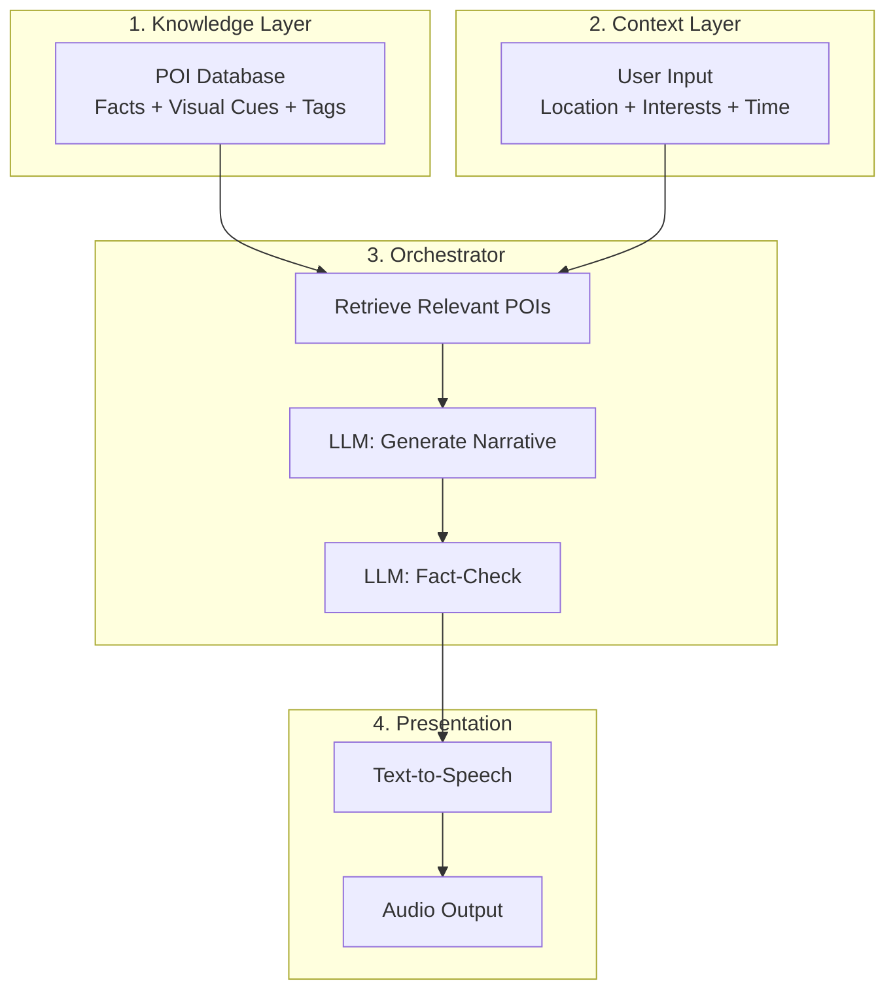

# Walking Tour: AI-Generated Audio Tours

> **A procedural narrative engine for the real world**

## What is Walking Tour?

Walking Tour is an AI-powered application that creates **personalized, narrative-driven audio walking tours** based on your location and interests. Unlike traditional audio guides that play the same content to everyone, Walking Tour generates unique tours each time, tailored to your preferences.

### The Vision

Imagine walking through a city and receiving a tour that:
- 🎭 **Matches your vibe**: History buff? Ghost hunter? Foodie? Architecture enthusiast? Each persona gets a completely different story
- 🎲 **Is unique every time**: Procedurally generated content means no two tours are identical
- 🎯 **Goes beyond facts**: Immersive narratives that make you feel the history, not just hear it
- 🔊 **Works eyes-free**: Designed for audio-only navigation so you experience the city, not your phone

### The Problem We're Solving

Traditional audio tours are:
- ❌ Generic (one-size-fits-all)
- ❌ Static (same content for everyone)
- ❌ Dry (Wikipedia-style facts)
- ❌ Limited (expensive to produce, hard to update)

### Our Solution

Walking Tour uses **Retrieval-Augmented Generation (RAG)** to:
- ✅ Dynamically select relevant stories based on your interests
- ✅ Weave facts into immersive narratives
- ✅ Verify accuracy with AI fact-checking
- ✅ Generate high-quality audio with persona-matched voices
- ✅ Scale to any city with automated data pipelines

---

## Current Status: Phase 1 Complete ✅

We've successfully built and validated the core content generation pipeline:

- ✅ **Narrative Generation**: GPT-4o creates engaging stories from curated facts
- ✅ **Fact-Checking**: GPT-4o-mini validates accuracy ("strict about facts, lenient about style")
- ✅ **Audio Synthesis**: OpenAI TTS with 4 distinct persona voices
- ✅ **50 Richmond POIs**: Manually curated dataset for testing

**What's Next**: Automated route planning and semantic search (Phase 2 & 3)

---

## Key Features

### Four Distinct Personas

| Persona | Focus | Voice Style | Example Hook |
|---------|-------|-------------|--------------|
| **The Architect** | Building design, materials, styles | Precise, appreciative | "Notice the corbels supporting that bay window..." |
| **The Ghost Hunter** | Dark history, folklore, mysteries | Whispered, suspenseful | "Three people died here. No one talks about it..." |
| **The Local** | Hidden spots, culture, modern life | Casual, friendly | "Locals skip this place, but the back alley..." |
| **The Time Traveler** | Historical immersion, sensory details | Transportive, narrative | "Close your eyes. It's 1540. You smell smoke..." |

### Safety-First Design

> **Critical**: Navigation instructions come from a **deterministic routing engine**, never the LLM. This prevents dangerous hallucinations like "cross the bridge" when no bridge exists.

- Visual cues for wayfinding ("Look for the red awning...")
- Fact-checking prevents misinformation
- Audio pacing designed for safe walking

### Cost-Efficient Architecture

- **~$0.05 per tour** (current Phase 1 costs)
- **Target: $0.01** (with caching and optimizations in Phase 3-4)
- Uses GPT-4o-mini for verification (10x cheaper than GPT-4o)
- Caches popular routes to reduce API costs

---

## The Roadmap

### Phase 1: Static Tour Generator ✅ **COMPLETE**
Prove the content pipeline works: generate → verify → audio

### Phase 2: Route Intelligence 🔜 **NEXT**
Automatically select optimal POIs and create walking routes

### Phase 3: RAG & Embeddings 📋 **PLANNED**
Semantic search replaces keyword matching for better personalization

### Phase 4: Location-Aware Prototype 📋 **PLANNED**
GPS-triggered playback for real walking tours

### Phase 5: Web Interface 📋 **PLANNED**
Mobile-friendly PWA for anyone to generate tours

---

## Architecture at a Glance

---

## Technology Stack

- **Backend**: Python + FastAPI (serverless-ready)
- **LLMs**: GPT-4o (generation) + GPT-4o-mini (verification)
- **TTS**: OpenAI TTS (cost-effective) or ElevenLabs (premium)
- **Vector DB**: Qdrant or pgvector (planned for Phase 3)
- **Routing**: Mapbox Directions API (Phase 2)
- **Frontend**: Progressive Web App / PWA (Phase 5)

---

## Dive Deeper

Ready to explore the full architecture and roadmap?

### 📘 [Read the Complete Architecture Documentation](ARCHITECTURE.md)

This comprehensive guide includes:
- Detailed phase-by-phase implementation plans
- Architecture diagrams for each phase
- Evaluation techniques and success criteria
- Cost breakdowns and scaling strategies
- Technical deep dives on key components
- Design principles and trade-offs

---

## Quick Start

Want to see this in action?

1. **Try the Demo** (coming soon): Listen to sample tours
2. **Read Phase 1 Details**: See how we built the content pipeline
3. **Explore the Code**: Check out the implementation

---

## Questions?

- 📖 **New to the project?** Start with the [Architecture Overview](ARCHITECTURE.md#system-architecture-overview)
- 🔧 **Want to contribute?** See [Phase 2 roadmap](ARCHITECTURE.md#phase-2-route-intelligence) for next steps
- 🤔 **Curious about design decisions?** Read [Key Design Principles](ARCHITECTURE.md#key-design-principles)

---

  <em>Built with ❤️ and AI</em> 
  <em>Starting in Richmond, Northern England 🏰</em>

